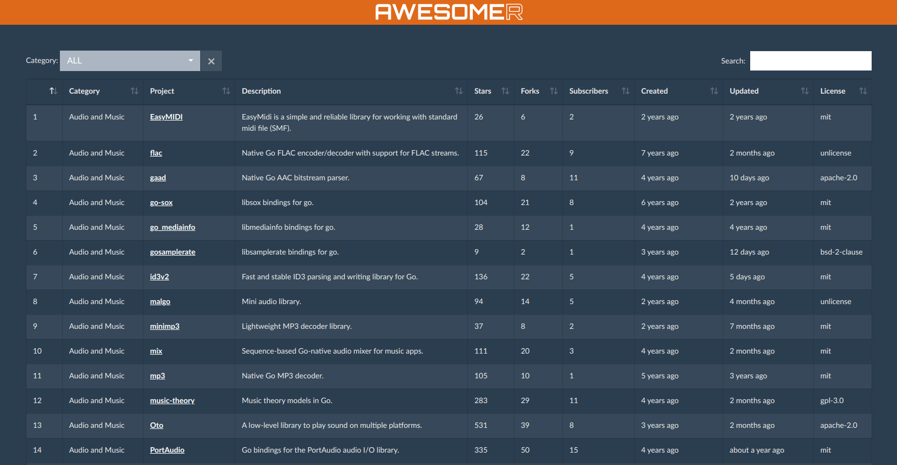

# Awesomer-go

Searchable, sortable UI for [awesome-go](https://github.com/avelino/awesome-go), with some extra metadata.



The extra data we currently load is:
- creation date
- last update date
- license
- social stats (stars, forks, followers)

We only support github. We also don't have handling for custom websites at the moment.

All data and curration is courtesy of the [awesome-go](https://github.com/avelino/awesome-go) project. Go there and donate.

### Development

To run the generator, create `.env` with settings and then

```bash
npm install
generator/bin/generate-data
```

You might want to configure GitHub OAuth client ID and secret, to have better rate limits. Also, during development (`GITHUB_CACHE_DIRECTORY`). Full list of envs can be seen in `generator/settings.js`.

Execute
```bash
npm run serve
```
if you want to work on frontend.

### TODO

- Better license info
- Support gitlab and/or bitbucket
- Load more project stats, eg. last commit or activity graph
- Scrape some images and info from projects and include them in the page.

### License

MIT
